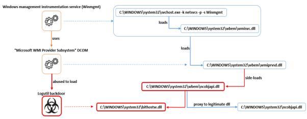
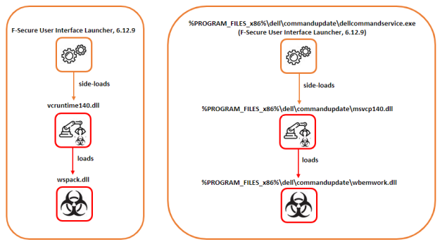
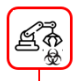
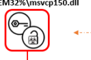
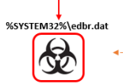
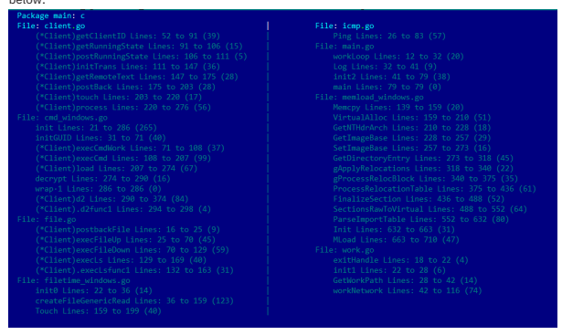

[comment]:<> (===START PAGE 1===)

{0}------------------------------------------------

All Rights Reserved.© 2023 Bitdefender.property of their respective owners.
All trademarks, trade names, and products referenced herein are the LABS **May 2023**
English Version only Exposing RDStealer

 Deep Dive into a Targeted Cyber-Attack Against East-Asia Infrastructure

{1}------------------------------------------------

Bitdefender.Labs  - english version only

# Contents

| OVERVIEW           |
|--------------------|
| KEY FINDINGS       |
| TECHNICAL DETAILS  |
| FILE COLLECTOR.  |
| LOGUTIL BACKDOOR … |
| INFRASTRUCTURE.  |
| IOCS.            |
| FLES               |
| DOMAINS.          |
| IP ADDRESSES.    |
| TTPS.            |

{2}------------------------------------------------

# Overview

Modern cyber-crime rings are becoming increasingly attracted to the use of legitimate components to achieve their goals.Execution of malicious components via DLL hijacking and persisting on affected systems by abusing legitimate scheduled tasks and services are just a few examples of their agility and focus.State-affiliated actors such as the notorious The APT29 group have successfully used this approach in the past by switching a binary responsible for updating Adobe Reader with a malicious component to abuse the corresponding scheduled task used for running the binary, and ultimately, to achieve persistence.Another strategy that aims to make the attackers keep a low profile is the use of locations that are less likely to be suspected to accommodate malware, and which are more likely to be excepted from security solution scrutiny.We identified these behaviors in a recent incident investigated by Bitdefender researchers, where a presumably custom malware tracked by Bitdefender as **Logutil** backdoor was deployed.The operation was active for more than a year with the end goal of compromising credentials and data exfiltration.Our investigation revealed that the operation started at least since early 2022.During this time, the attackers attempted to load their tools through multiple means, the **Logutil** being their main tool of choice.**AsyncRat** was also used at the earlier stages of infection.Based on used infrastructure, it was established that **CobaltStrike** is another tool from the attackers' arsenal.The target of this operation was a company activating in the **Technology/IT Services** industry in East Asia.
# Key Findings

% DLL search order Hijacking involving the "**Microsoft WMI Provider Subsystem" DCOM** and %SYSTEM32%\wbem\ncobjapi.dll loader
% Use of locations that are less likely to be suspected to contain malware and that are more likely to be excepted from scanning by the security solutions 
% Use of tools capable of collecting credential material from various applications such as MobaXterm, mRemoteNG, 
KeePass, Chrome passwords and history, and many others 
% Attempts of exfiltrating mysql data by accessing the server process memory and attempts of dumping LSASS 
memory 
% Capabilities to infect other systems in case a RDP session was established to the already infected system by placing malicious components to the\\tsclient\c\subfolders if tsclient share was enabled

### Technical Details

The primary purpose of the attack is credentials theft and data exfiltration as concluded after analyzing the gathered artefacts.In pursuit of staying unnoticed, the attackers used the following locations for hiding their tools:% c:\windows\system32\% c:\windows\system32\wbem\% c:\windows\security\database\% %PROGRAM_FILES%\f-secure\psb\diagnostics
% %PROGRAM_FILES_x86%\dell\commandupdate\% %PROGRAM_FILES%\dell\md storage software\md configuration utility\The locations within **%PROGRAM_FILES%** and **%PROGRAM_FILES_x86%** most likely help attackers blend the malware into legitimate software.Another location where malware was found is **c:\windows\security\database\**, which corresponds to the location for windows security files, a location probably chosen to evade detection.Microsoft recommends excepting some files within that location from scanning, so the attackers' choice of dropping the malware there might be motivated by the fact that there might be security solutions that would ignore all files within that location from scanning, including malware.The collected evidence shows that the service **Winmgmt** was indirectly abused to ensure persistence for **Logutil** backdoor.This was possible because of DLL Hijacking with the help of the malicious loader located at %SYSTEM32%\wbem\ncobjapi.dll.The analysis of the **Winmgmt** behavior shows that it uses the **"Microsoft WMI Provider** 
Subsystem" DCOM that is implemented in **c:\windows\system32\wbem\wmiprvsd.dll**.The **wmiprvsd.dll**
DLL depends on **ncobjapi.dll** DLL which resides in **c:\windows\system32\**, but because of the DLL search order 

{3}------------------------------------------------

algorithm, the **%SYSTEM32%\wbem\** is inspected first, and so, the malicious loader will be loaded.The malicious 

[comment]:<> (===START IMAGE DETECTED===)

[comment]:<> (===START EMBEDDED IMAGE EXTRACTION===)
Windows management instrumentation service (Winmgmt)
uses
"Microsoft WMI Provider Subsystem" DCOM
abused to load
Logutil backdoor
C:\WINDOWS\system32\svchost.exe -k netsvcs -p -s Winmgmt
loads
C:\WINDOWS\system32\wbem\wmisvc.dll
loads
C:\WINDOWS\system32\wbem\wmiprvsd.dll
side-loads
C:\WINDOWS\system32\wbem\ncobjapi.dll
C:\WINDOWS\system32\bithostw.dll
proxy to legitimate dil
C:\WINDOWS\system32\ncobjapi.dll
[comment]:<> (===END EMBEDDED IMAGE EXTRACTION===)

[comment]:<> (===END IMAGE DETECTED===)

loader will ensure that it correctly mimics the legitimate **ncobjapi.dll** functionality by proxy-ing the calls to exported functions to corresponding ones of the legitimate DLL.
The use of **%SYSTEM32%\wbem\ncobjapi.dll** for sideloading is not new, as other known threats such as operators of **RadRat** and **Lazarus** group have used the same technique for loading the malicious DLL.However, the technique used by the current threat actors stands out for the way DLL sideloading takes placehappens:the final payload is not ncobjapi.dll, but other DLL files located either in **c:\windows\system32\** or in **c:\windows\system32\wbem\,** such as the **bithostw.dll** as shown in the previous image.
The attackers expended significant effort to defenses, as suggested by the extensive use of side-loading the **F-Secure** 

[comment]:<> (===START IMAGE DETECTED===)

[comment]:<> (===START EMBEDDED IMAGE EXTRACTION===)
F-Secure User Interface Launcher, 6.12.9
%PROGRAM_FILES_x86%\dell\commandupdate\dellcommandservice.exe
(F-Secure User Interface Launcher, 6.12.9)
side-loads
vcruntime140.dll
side-loads
%PROGRAM_FILES_x86%\dell\commandupdate\msvcp140.dll
loads
wspack.dll
loads
%PROGRAM_FILES_x86%\dell\commandupdate\wbemwork.dll
[comment]:<> (===END EMBEDDED IMAGE EXTRACTION===)

[comment]:<> (===END IMAGE DETECTED===)
 User Interface Launcher, version **6.12.9 in particular**:F-Secure has been informed of the binary abuse to perform side-loading of malicious DLLs used in the attack.F-Secure acknowledged that, as the binary was used independently, outside of the normal software functionality, no further action is required.The F-Secure product installed on a system is not vulnerable to the DLL side-loading abuse.Another interesting detail that emerged after the analysis of one of the samples of **bithostw.dll** was the use of Execution Guardrails (T1480) for defense evasion, which involved the use of the infected computer's name to derive the file name where the obfuscated and UPX-packed **Logutil backdoor** resides:
{4}------------------------------------------------

[comment]:<> (===START IMAGE DETECTED===)

[comment]:<> (===START EMBEDDED IMAGE EXTRACTION===)
EM32%\msvcp150.dll
[comment]:<> (===END EMBEDDED IMAGE EXTRACTION===)

[comment]:<> (===END IMAGE DETECTED===)

Evidence suggests that the legitimate **rdpclip.exe** from one of the affected machines was also used to side-load the 

[comment]:<> (===START IMAGE DETECTED===)

[comment]:<> (===START EMBEDDED IMAGE EXTRACTION===)
%SYSTEM32%\edbr.dat
[comment]:<> (===END EMBEDDED IMAGE EXTRACTION===)

[comment]:<> (===END IMAGE DETECTED===)
 Logutil malicious DLL with the help of the scheduled task **"Microsoft\Windows\NetTrace\GatherInfo"**.The use of that task name can be categorized as an attempt to mimic the legitimate scheduled task "Microsoft\Windows\NetTrace\GatherNetworkInfo".It is worth mentioning that almost all files related to the incident have corresponding digital signatures with the same serial number - the purpose of that being evading detection:
{5}------------------------------------------------

Verified:Signed Signers:Catalog:<path to file>
 ARGOS LABS Status:A required certificate is not within its validity period when verifying against the current system clock or the timestamp in the signed file.Valid Usage:Code Signing Serial Number:00 F7 B7 5C 60 5B 00 83 95 73 8A AC 06 AB E3 B4 70 Thumbprint:AD8F0BEA52A943CF63A0E6F2AEC0EE25127E6E76 Algorithm:1.2.840.113549.1.1.11 Valid from:3:00 AM 2019-07-16 Valid to:2:59 AM 2021-07-20 Sectigo RSA Code Signing CA Status:Valid Valid Usage:Code Signing, Timestamp Signing Serial Number:1D A2 48 30 6F 9B 26 18 D0 82 E0 96 7D 33 D3 6A Thumbprint:94C95DA1E850BD85209A4A2AF3E1FB1604F9BB66 Algorithm:1.2.840.113549.1.1.12 Valid from:3:00 AM 2018-11-02 Valid to:2:59 AM 2031-01-01 Sectigo Status:Valid Valid Usage:Client Auth, Code Signing, EFS, Email Protection, IPSEC Tunnel, IPSEC User, Server Auth, Timestamp Signing Serial Number:01 FD 6D 30 FC A3 CA 51 A8 1B BC 64 0E 35 03 2D Thumbprint:2B8F1B57330DBBA2D07A6C51F70EE90DDAB9AD8E Algorithm:1.2.840.113549.1.1.12 Valid from:3:00 AM 2010-02-01 Valid to:2:59 AM 2038-01-19 Signing date:12:07 PM 2021-06-30 More details of the capabilities of the tools can be found in the following sections.
### File Collector

Located at "%**PROGRAM_FILES%\dell\md storage software\md configuration utility\modular disk service daemon.** exe", the identified sample presents traces of a tool specialized in data gathering.Implemented in Go, the sample has metadata that easily allows us to infer its capabilities, as shown in the table listing the used packages below:
| package name   | description                                                                            |
|----------------|----------------------------------------------------------------------------------------|
| cli            | Implements the capture of the clipboard content by using windows API such as           |
|                | OpenClipboard and GetClipboardData;                                                    |
| key            | Implements keystroke capture alongside with window name;                               |
| main           | Acts as the orchestrator and uses the package modules to perform persistence setup and |
|                | start the routine for data collection if certain conditions are met;                   |
| modules        | Implements different functions used for collecting and staging the data for further    |
|                | exfiltration;                                                                          |

{6}------------------------------------------------

| he modules information extracted from one of the binaries looks like this:  |                                            |
|------------------------------------------------------------------------------|--------------------------------------------|
| Package modules:modules                                                     | Package utils:utils                       |
| File:clip.go                                                                | File:de.go                                |
| ClipInfo Lines:7 to 17 (10)                                                 | De Lines:9 to 21 (12)                     |
| File:dirs.go                                                                | RandInt Lines:21 to 23 (2)                |
| ZipDir Lines:15 to 74 (59)                                                  | File:file.go                              |
| ZipDirfunc1 Lines:37 to 85 (48)                                             | init0 Lines:26 to 40 (14)                 |
| LogDir Lines:74 to 151 (77)                                                 | createFileGenericRead Lines:40 to 51 (11) |
| LogDirfunc1 Lines:85 to 154 (69)                                            | Touch Lines:51 to 94 (43)                 |
| DiskEnum Lines:151 to 199 (48)                                              | IsFileExist Lines:94 to 104 (10)          |
| DiskEnumfunc1 Lines:154 to 181 (27)                                         | PathExists Lines:104 to 115 (11)          |
| needEnumDisks Lines:199 to 217 (18)                                         | CopyFile Lines:115 to 126 (11)            |
| File:startup.go                                                             | File:log.go                               |
| init Lines:12 to 12 (0)                                                     | init Lines:15 to 15 (0)                   |
| getAllUserStartupDir Lines:25 to 31 (6)                                     | EncryptGCM Lines:19 to 152 (133)          |
| writeInfoGather Lines:31 to 76 (45)                                         | DecryptGCM Lines:75 to 152 (77)           |
| WriteUsrStartup Lines:76 to 106 (30)                                        | GenerateNonce Lines:134 to 169 (35)       |
| File:wbem.go                                                                | WriteFileLog Lines:169 to 185 (16)        |
| WorkWithWbem Lines:21 to 57 (36)                                            | File:net.go                               |
|                                                                              | GetLocalIP Lines:8 to 34 (26)             |
| Package cli:cli                                                             | Package main:command\-line\-arguments     |
| File:cli windows.go                                                         | File:main.go                              |
| init Lines:21 to 31 (10)                                                    | writePersist Lines:21 to 39 (18)          |
| readAll Lines:34 to 58 (24)                                                 | diskMounted Lines:39 to 57 (18)           |
|                                                                              | work Lines:57 to 62 (5)                   |
| Package key:key                                                             | startClip Lines:62 to 88 (26)             |
| File:key.go                                                                 | notifyMaster Lines:88 to 111 (23)         |
| StartLogger Lines:10 to 24 (14)                                             | workMonitor Lines:111 to 147 (36)         |
| getForegroundWindow Lines:24 to 34 (10)                                     | main Lines:147 to 149 (2)                 |
| getWindowText Lines:34 to 47 (13)                                           |                                            |
| windowLogger Lines:47 to 70 (23)                                            |                                            |
| keyLogger Lines:70 to 395 (325)                                             |                                            |
| File:vars.go                                                                |                                            |
| init Lines:90 to 94 (4)                                                     |                                            |

| package name   | description          |
|----------------|----------------------|
| utils          | Implements encryptic |
|                | function             |

Implements encryption and decryption functions, file attribute manipulation, and log The modules information extracted from one of the binaries looks like this:First thing that happens after the main function starts executing is the creation of two go routines for clipboard data capture and for keystroke capture, that WOUld periodically push the gathered data into the log file c:\users\public\log.log, in form of base64 encoded AES-GCM encrypted strings that have the format "<domain>\<username> clp:<captured data>" and "<domain>\<username> k:<window text><new line><captured keystrokes>" respectively, one per line.
The same AES-GCM encryption algorithm was used for storing into the binary the strings representing file extensions, locations where to look for information and locations where to drop tools.
Next, in an infinite loop, the function diskMounted will be called to check the availability of the tsclient and one of drives C, D, E, F, G and H.The availability of one of those shared drives will trigger the execution of these three functions - main.notifyMaster, main.writePersist and modules.DiskEnum.
→ The  main.notifyMaster function makes and http GET request to https://<a local ip address>:7443/pdr.
php?name=<hostname>&ip=<host local ip address>, to notify the attackers that a client is connected to the infected system and probably to be prepared for manual exfiltration of the collected data.The use of a local IP address as the server address indicates that there is another component that acts like a proxy or a server, but this component was not identified.
→ The main.writePersist function, as the name suggests, is responsible for persistence setup, but it will ensure the persistence of malicious components on the client that initiated the RDP connection to the infected machine, after these components are successfully copied to the\\tsclient\c\at specific locations. Two functions will be called to do the job:
{7}------------------------------------------------

| File collector                                                                                                   |                                                                                                                        |
|------------------------------------------------------------------------------------------------------------------|------------------------------------------------------------------------------------------------------------------------|
| Located at "%PROGRAM_FILES%\dell\md storage software\md configuration utility\modular disk service daemon.      | exe", the identified sample presents traces of a tool specialized in data gathering.Implemented in Go, the sample has |
| metadata that easily allows us to infer its capabilities, as shown in the table listing the used packages below:|                                                                                                                        |
| package name                                                                                                     | description                                                                                                            |
| cli                                                                                                              | Implements the capture of the clipboard content by using windows API such as                                           |

| Valid Usage: Client Auth, Code Signing,      |
|-----------------------------------------------|
| EFS, Email Protection, IPSEC Tunnel,          |
| IPSEC User, Server Auth, Timestamp Signing    |
| Serial Number: 01 FD 6D 30 FC A3 CA 51 A8 1B |
| BC 64 0E 35 03 2D                             |

| Verified: Signed           |                                                                                 |
|-----------------------------|---------------------------------------------------------------------------------|
| Catalog:                   | <path to file>                                                                  |
| Signers:                   |                                                                                 |
| ARGOS LABS                  |                                                                                 |
| Status:                    | A required certificate is not within its validity period when                   |
|                             | verifying against the current system clock or the timestamp in the signed file.|
| Valid Usage:               | Code Signing                                                                    |
| Serial Number:             | 00 F7 B7 5C 60 5B 00 83 95 73                                                   |
| 8A AC 06 AB E3 B4 70        |                                                                                 |
| Thumbprint:                | AD8F0BEA52A943CF63A0E6F2AEC0EE25127E6E76                                        |
| Algorithm:                 | 1.2.840.113549.1.1.11                                                           |
| Valid from:                | 3:00 AM 2019\-07\-16                                                            |
| Valid to:                  | 2:59 AM 2021\-07\-20                                                            |
| Sectigo RSA Code Signing CA |                                                                                 |
| Status:                    | Valid                                                                           |
| Valid Usage:               | Code Signing, Timestamp Signing                                                 |
| Serial Number:             | 1D A2 48 30 6F 9B 26 18 D0 82                                                   |
| E0 96 7D 33 D3 6A           |                                                                                 |
| Thumbprint:                | 94C95DA1E850BD85209A4A2AF3E1FB1604F9BB66                                        |
| Algorithm:                 | 1.2.840.113549.1.1.12                                                           |
| Valid from:                | 3:00 AM 2018\-11\-02                                                            |
| Valid to:                  | 2:59 AM 2031\-01\-01                                                            |
| Sectigo                     |                                                                                 |

and it creates an archive with each folder of interest from the tsclient C drive such as:In case the malware finds the folders of interest within any of the user home directories from the **tsclient** share, a ZIP archive containing the respective folder's content is created and will be saved as "C:\Users\Public\Documents\<ID><timestamp>.dat" on the initial infected system where the ID is the one indicated in the second column of the previous table.While inspecting users' home directories, the folders "**appdata\roaming\**", "appdata\local\", Desktop, **Documents** and **Downloads** are searched for files with specific extensions and file names.Once found, it triggers the collection of the subfolder containing the file:The archives will be saved at **C:\Users\Public\Documents\**, having the same file name format **<ID><timestamp>.dat**.After inspecting each home directory on the **tsclient** share, the function proceeds with listing the 
"**\\tsclient\c\Program Files (x86)\**" and "**\\tsclient\c\Program Files\**" in search of the same previously described extensions and file names.Then the tool proceeds to look for the same information within the following location -\\tsclient\d\, **\\tsclient\e\**,\\tsclient\f\, **\\tsclient\g\** and **\\tsclient\h\**, but with a slightly different approach as a list of strings is used toskip the listing of subfolders that contain one of the strings from the following list:

{8}------------------------------------------------

windows,datareporting,libreoffice,node_modules,all user,default user,user data,.rust,download, desktop,document,assembly,.git,microsoft,winsxs,en-us,mui,.net,dotnet, visual,cache, recycle,systemapp,driverstore,catroot,package, prefetch,installer,font,cursors Moreover, a mechanism exists that limits the listing to once a week, for the shared drives starting with D.The file attributes of a file located at "**users\public\Videos\vcache.dat**" are used to determine the difference from the time of the last modification to the current moment, and this difference is used to determine if a week has passed since the last scan.If the file does not exist or the file attributes indicate that a listing should be performed, then the file is created and the word "**peek**" is written into it, completing this way the file collection process.As a remark here, the algorithm limiting the listing once a week seems to not work properly as the "**users\public\** Videos\vcache.dat" string, without a drive letter or a share location, is an invalid file location.It is most likely that the attackers intended to create that file on the **\\tsclient\c\**, as it makes more sense in case there are multiple RDP clients connecting to the infected system.

## Logutil Backdoor

Written in Go, the **Logutil** backdoor implements the usual capabilities that are needed to maintain the foothold in the 

[comment]:<> (===START IMAGE DETECTED===)

[comment]:<> (===START EMBEDDED IMAGE EXTRACTION===)
Package main:c
File:client.go
(*Client)getClientID Lines:52 to 91 (39)
(*Client)getRunningState Lines:91 to 106 (15)
(*Client)postRunningState Lines:106 to 111 (5)
(*Client)initTrans Lines:111 to 147 (36)
(*Client)getRemoteText Lines:147 to 175 (28)
(*Client)postBack Lines:175 to 203 (28)
(*Client) touch Lines:203 to 220 (17)
("Client)process Lines:220 to 276 (56)
File:cmd_windows.go
init Lines:21 to 286 (265)
initGUID Lines:31 to 71 (40)
(*Client) execCmdWork Lines:71 to 108 (37)
(*Client) execCmd Lines:108 to 207 (99)
("Client)load Lines:207 to 274 (67)
decrypt Lines:274 to 290 (16)
wrap-1 Lines:286 to 286 (0)
(*Client)d2 Lines:290 to 374 (84)
(*Client).d2func1 Lines:294 to 298 (4)
File:file.go
(*Client)postbackFile Lines:16 to 25 (9)
(*Client) execFileUp Lines:25 to 70 (45)
(*Client) execFileDown Lines:70 to 129 (59)
(*Client) execLs Lines:129 to 169 (40)
(*Client).execLsfunc1 Lines:132 to 163 (31)
File:filetime_windows.go
inite Lines:22 to 36 (14)
createFileGenericRead Lines:36 to 159 (123)
Touch Lines:159 to 199 (40)
File:icmp.go
Ping Lines:26 to 83 (57)
File:main.go
workLoop Lines:12 to 32 (20)
Log Lines:32 to 41 (9)
init2 Lines:41 to 79 (38)
main Lines:79 to 79 (0)
File:menload_windows.go
Memcpy Lines:139 to 159 (20)
VirtualAlloc Lines:159 to 210 (51)
GetNTHdrArch Lines:210 to 228 (18)
GetImageBase Lines:228 to 257 (29)
SetImageBase Lines:257 to 273 (16)
GetDirectoryEntry Lines:273 to 318 (45)
gApply Relocations Lines:318 to 340 (22)
gProcessRelocBlock Lines:340 to 375 (35)
ProcessRelocationTable Lines:375 to 436 (61)
FinalizeSection Lines:436 to 488 (52)
SectionsRawToVirtual Lines:488 to 552 (64)
ParseImportTable Lines:552 to 632 (80)
Init Lines:632 to 663 (31)
Mload Lines:663 to 710 (47)
File:work.go
exitHandle Lines:18 to 22 (4)
initi Lines:22 to 28 (6)
GetWorkPath Lines:28 to 42 (14)
workNetwork Lines:42 to 116 (74)
[comment]:<> (===END EMBEDDED IMAGE EXTRACTION===)

[comment]:<> (===END IMAGE DETECTED===)
 victim's network - capabilities such as file download/upload and command execution.All collected samples of this tool have common executable attributes.For example, all of them export the Log function and have the export name of either logutil32.dll or logutil64.dll, depending on the architecture.The go metadata from the samples offer a good understanding of how the **Logutil** works, and further details are provided below:The **main.Log** function that represents the logical entry point of the Logutil, proceeds with the decryption of the config string that is stored as a base64 encoded string.The result of the decoding is then decrypted using a XOR-byte operation using the first byte of the decoded buffer as the key and is applied for the entire buffer.The result of the decryption is a string containing multiple parameters separated by "\#":3509200054\#https://\#dns-a.ntp-update.com:53\#info\#exit\#/sys/class/net/\#idle\#sleep\#ls\#shell\#fu\#fd\#/bin/bash\#/bin/sh\#/bin/zsh\#/update\#/info\#${COMSPEC}\#${SystemRoot}\#TEMP\#winsxs.dat\#quic Although many of these parameters are self-explanatory, such as the http schema, the C2 address and command identifier that will be described shortly, we'll bring a few features into the spotlight, as they might be more counterintuitive:% The last parameter, corresponding to the **quic** value in the previous config indicates that a proxy should be used and the protocol of the proxy; In the previous example, the proxy over QUIC protocol will be used, meaning that the C2 in this case is the address of the proxy server;
% The parameters "/bin/bash", "/bin/sh" and "/bin/zsh" are not referred anywhere in the identified samples, but might 

{9}------------------------------------------------

indicate the type of the Linux shell to be used for execution, meaning that the Logutil backdoor is probably a multiplatform tool; The strings obtained from the config are used to initialize the Client structure that will be further passed to other functions to perform their task:type main.Client struct { host string url string proxy string ID string _id string startT time.Time ips string lock sync.RWMutex shellCmd *exec.Cmd stdinPipe io.WriteCloser http *http.Client }
Communication with the C2 server is done by making subsequent http GET and POST requests where JSON messages described by the following structure are exchanged:type proto.Info struct { Cm string `json:"c"` P1 string `json:"p"` }
Another structure is used by the file upload/download operation to perform chunk upload/download where for each chunk a **zlib** compression is applied followed by base64 encoding:type proto.FileUp struct { Path string `json:"path"` Offset int64 `json:"offset"` Size int64 `json:"size"` IsError bool `json:"iserr"` Data string `json:"data"` }
The first message sent to the C2 is the return value of **getRunningState** containing the amount of time the backdoor is running and information from the **main.Client** structure.The resulting string is base64 encoded and is sent to the C2 as part of the JSON representation of the **proto.Info** structure in the body of the POST request to the https://<host:port>/update.The same information will be sent periodically, but the ICMP protocol will be used instead.The commands from the C2 are obtained by making http GET request to **https://<host:port>/info** from which a proto.Info structure will be obtained, where the Cm field will be interpreted as the command identifier and the P1 will be the argument for that command.In some cases, multiple requests will be made.The output of the commands is sent to the C2 using POST requests to **https://<host:port>/update**.All supported commands are the following:
| command   | parameter               | details                                                                     |
|-----------|-------------------------|-----------------------------------------------------------------------------|
| set       | <key>=<val>             | The name of the variable and its value are received; The os.Setenv function |
|           |                         | is used to assign the given value to the indicated variable;                |
| load      | <Dll path> or <base64   | The given DLL will be reflectively loaded into the memory;                  |
|           | representation of a dll |                                                                             |
|           | to be loaded into the   |                                                                             |
|           | memoty>                 |                                                                             |
| c         | <command>               | Executes command with output capture, create a shell object or interact     |
|           |                         | with previously created shell                                               |
| s         | <command>               | Executes command without output capture, create a shell object or interact  |
|           |                         | with previously created shell                                               |

{10}------------------------------------------------

| command   | parameter               | details                                                                           |
|-----------|-------------------------|-----------------------------------------------------------------------------------|
| t         | <filepath1>,<filepath2> | Touch operation that sets the file attributes of the first file to the second one |
| d1        | <hex encoded data>      | Calls CryptUnprotectData on the received data, and send the result back           |
| fu        |                         | Uploads the file in chunks on the victim                                          |
| fd        |                         | Downloads the file in chunks from the victim                                      |
| idle      |                         | Sleeps for an increasing amount of time; The sleep time starts with 6             |
|           |                         | seconds and increases each time by a random integer value of between 0            |
|           |                         | and 4;                                                                            |
| sleep     | <int>                   | Sleeps for indicated amount of seconds                                            |
| ls        | <path>                  | Performs a recursive listing of the folder                                        |
| info      |                         | Sends information about the implant, such as the amount of time it is             |
|           |                         | running and the assigned id                                                       |
| exit      |                         | Exit                                                                              |

# Infrastructure

| Domain                                                                                                            | Resolved IP (resolved on 2023.04.04)   |
|-------------------------------------------------------------------------------------------------------------------|----------------------------------------|
| a\-ad\-tml.ntp\-update.com                                                                                    | 34.96.222.22                         |
| rps\-a.ntp\-update.com                                                                                        | 34.96.222.22                         |
| a\-rps.ntp\-update.com                                                                                        | 35.220.144.179                       |
| a\-rps.ntp\-update.com:123                                                                                    |                                        |
| dns\-a.ntp\-update.com:53                                                                                     | 35.220.144.179                       |
| a\-tb.ntp\-update.com                                                                                         | 35.220.202.191                       |
| alast.sun\-java.com:443                                                                                       | 35.220.144.179                       |
| alast.ntp\-update.com:48918                                                                                   | 35.220.144.179                       |
| dell\-a.ntp\-update.com                                                                                       | 35.220.144.179                       |
| dell\-a.ntp\-update.com:123                                                                                   |                                        |
| It's worth mentioning that some of the subdomains reflect particularities of the environment where the implant is |                                        |

The C2 information obtained from the config strings of identified samples gives us insight into the attackers' preferences for choosing the infrastructure provider:deployed (e.g the location where the backdoor is being dropped, as in the case of the domain **dell-a.ntp-update.com** and the **%PROGRAM_FILES%\dell** location of the backdoor).Besides the C2 addresses from the Logutil configs, one more domain is used by attackers, which was obtained from two AsyncRat samples - one standalone executable located at **%PROGRAM_FILES%\f-secure\psb\diagnostics\fs_ui.exe** (md5:**dec5b1c097b8d547666f76b55c5d0fdc**) and another in the form of a donut shellcode executed using sideloading and the legitimate executable **c:\\program files (x86)\\f-secure\\psb\\diagnostics\\fs_ui.exe**.These samples seem to be artefacts from the earliest moments of infection and both samples communicate with the C2 **a-sp-rps.0g6666.** com:1900 that at the moment of writing resolves to the already-known IP address **34.96.222.22.**

| linux.ntp\-update.com     |
|---------------------------|
| windows.0g6666.com        |
| esxi\-lty.ntp\-update.com |

After inspecting passive DNS information for the known IP addresses, yet another domain name used by attackers came to light - **windows.javaupdate-cdn.com**, that resolves to the **35.220.144.179** address.The domain javaupdatecdn.com has at least other two subdomains - **adobe.javaupdate-cdn.com** and **flash.javaupdate-cdn.com** that resolves to **34.96.235.162** and **35.220.190.145** respectively.The **flash.javaupdate-cdn.com** domain, based on VT data, is related to two samples - **6cf0007b0d487f899fbd05ffc3401211** and **3294710063ee0dc7d6dfffc4de337b68**, that are a **CobaltStrike** Beacon implant and a loader for **AsyncRat**, which suggests that the attackers used these tools in the past.With continued digging into the passive DNS information, more domain names that seem related to the attackers' operations were identified - domains that enforce the hypothesis that the attackers target multiple platforms and OS and the LogUtil is a multi-platform backdoor, as suggested by the following subset of domains (the full list of domains can be found in the IOC section):
{11}------------------------------------------------

ubuntu-ndi.ntp-update.com Three unknown domain names, obtained from pDNS data, also seem related to the attackers' operations - a fact assessed with medium confidence as these domains resolved to the same group of IP addresses in 2020, at the time when the IP addresses were already used as C2 by attackers:h1.xpjpz400.com cg.xpjpz400.com letsencrypt.msupdatesync.com Based on the same pDns data, it was established that the subdomains of the already known malicious domains are used by attackers at least from 2020-03-29.Logutil uses TLS to communicate with the C2, and here is the information about the TLS certificates:
| Cert fingerprint                                                                                                          | Cert dns     | Obs.                                         |
|---------------------------------------------------------------------------------------------------------------------------|--------------|-----------------------------------------------|
| 7d5ea2769d07326c4f7418ff422bc30c0f6d7135                                                                                  | cugaa.com    | It was noticed to be used starting with       |
|                                                                                                                           |              | 2023.03.30 as a replacement for the cert      |
|                                                                                                                           |              | corresponding to op888kai.com;                |
| 3dc9116e3bce0f5e8afbcc69928ee473b0ff0eb4                                                                                  | op888kai.com | It was extensively used during the operation; |
| 82abe94672dc3498be7ea57c2de19affdb9e98f5                                                                                  |              | Self\-signed                                  |
| Based on certificate fingerprints, it was possible to discover a few more IP addresses that, with high confidence, belong |              |                                               |

to the attackers' infrastructure:35.220.183.209 35.208.179.162 34.92.13.119 An interesting fact emerged from the analysis of the geolocation of all these IP addresses and the ASN information– all belong to GCP and all of them are located in Hong Kong except for **35.208.179.162,** which is in the US.
# Iocs

| md5                              | file path                                             |
|----------------------------------|-------------------------------------------------------|
| e89cb63e1352a1c9f86e03e4c744b5cd | %SYSTEM32%\wbem\ncobjapi.dll                          |
| f51e88b159b5661f0b83c3947f3e0b24 | %SYSTEM32%\wbem\ncobjapi.dll                          |
| 61ac19b0f812b10e7690109430cba4a5 | vcruntime140.dll                                      |
| d80827879b2e15b18a9c0feaf5a3c859 | %PROGRAM_FILES%\dell\md storage software\md           |
|                                  | configuration utility\modular disk service daemon.exe |
| 1d6b37bd2dfc9d6b4a811f90f6f48dce | %SYSTEM32%\wbem\lzsrv64.dll                           |
|                                  | %SYSTEM32%\mcpbroker.dll                              |
| 2af313bdd3c54d95303c14786a3ad58d | %SYSTEM32%\wbem\efsmgr32.dll                          |
| d5cdeba19d1a31b5be424a82210e3417 | %SYSTEM32%\wbem\secure64.dll                          |
| de9233ed6689f84286fe0b7da8bc89e9 | %SYSTEM32%\splsys64.dll                               |
|                                  | %SYSTEM32%\mcpbroker.dll                              |
| e7121980263c08d2a759df827f97ecae |                                                       |
| 78a7df158236edd372946347a156e5bc | %SYSTEM32%\bithostw.dll                               |
|                                  | %SYSTEM32%\bithosts.dll                               |
|                                  | %SYSTEM32%\efsmgr32.dll                               |
| 2b1130775c44be96990b2916ba071f40 | %SYSTEM32%\efsmgr32.dll                               |
| 211ffebfbf679b713148c6dad94ec1df | %SYSTEM32%\lzsrv64.dll                                |
| 3b8424499183af6f886f722d85353abf | %SYSTEM32%\splsys64.dll                               |
|                                  | %SYSTEM32%\efsmgr32.dll                               |

## Files

{12}------------------------------------------------

## 

Bitdefender® Labs - english version only

| md5                              | file path                                            |
|----------------------------------|------------------------------------------------------|
| 5a5e02256c0a8b65b2db8a0f88887744 | wspack.dll                                           |
|                                  | %SYSTEM32%\bithostw.dll                              |
|                                  | %SYSTEM32%\wbem\bithosts.dll                         |
|                                  | %WINDOWS%\temp\__deleted.dat                         |
| 1325ad15712a875ff61de3bbb0eccebd |                                                      |
| dec5b1c097b8d547666f76b55c5d0fdc | %PROGRAM_FILES%\f\-secure\psb\diagnostics\fs_ui.exe  |
| b7538226437cea21297b94f37d2c2813 | %PROGRAM_FILES%\f\-secure\psb\diagnostics\fs_ui.exe  |
| 6cf0007b0d487f899fbd05ffc3401211 |                                                      |
| 3294710063ee0dc7d6dfffc4de337b68 |                                                      |
| 003d6351a2a2a2835f2b64a999963ec1 | %PROGRAM_FILES_x86%\dell\commandupdate\wbemwork.dll  |
| e89cb63e1352a1c9f86e03e4c744b5cd | %WINDOWS%\temp\__to_be_deleted.dat                   |
| 20ef20fd88dc7a5e90908f1667c08d11 | %SYSTEM32%\bithostw.dll                              |
|                                  | %SYSTEM32%\winrpc32.dll                              |
| f18eb7a820f75e51b619b14967c83bb2 | %PROGRAM_FILES_x86%\dell\commandupdate\wbemwork2.dll |
| b7538226437cea21297b94f37d2c2813 | %PROGRAM_FILES_x86%\dell\commandupdate\             |
|                                  | dellcommandservice.exe                               |
| 43b238bf6829e6f1056749bebdc01dbe | %SYSTEM32%\msvcp150.dll                              |
| a83cdb7efbe7bbc4dafa1c11578e6372 | %SYSTEM32%\edbr.dat                                  |
| f14a812c6c377e52fb98f8d4c1ed0abd |                                                      |
| 2a421eec6784f1675585e9b428c1b68c | %PROGRAM_FILES_x86%\dell\commandupdate\             |
|                                  | dellcommandupdate.exe                                |
| 5c613c1f1f426d7b4630673966a125ba | %PROGRAM_FILES_x86%\dell\commandupdate\msvcp140.dll  |
| ea4cee8027df495c0da7b22e5a9d8457 | %WINDOWS%\temp\winsxs.dll                            |
| 32efbf302aaa2845d3a2b76a50840dc2 | %SYSTEM32%\msvcp150.dll                              |
| 47a02b5f59bbc62b7f4be0f4ce7574cd | %WINDOWS%\security\database\msvcp150.dll             |
| 13f5490acf5f5fab2f43f71999563bb9 | %WINDOWS%\security\database\msprotect.dll            |
| 9fc12edb2e5f193ed4ae365a57c47ffb | %WINDOWS%\security\database\edbt.dat                 |

| a\-ad\-tml.ntp\-update.com   |
|----------------------------------|
| rps\-a.ntp\-update.com       |
| a\-rps.ntp\-update.com       |
| dns\-a.ntp\-update.com       |
| a\-tb.ntp\-update.com        |
| alast.sun\-java.com          |
| alast.ntp\-update.com        |
| dell\-a.ntp\-update.com      |
| a\-sp\-rps.0g6666.com        |
| og8888.0g6666.com            |
| windows.javaupdate\-cdn.com  |
| adobe.javaupdate\-cdn.com    |
| flash.javaupdate\-cdn.com    |
| linux.0g6666.com             |
| ad.ntp\-update.com           |
| linux.ntp\-update.com        |
| windows.0g6666.com           |
| www.0g6666.com               |
| wt.ntp\-update.com           |
| aliyun.ntp\-update.com       |

Domains

{13}------------------------------------------------

cloud.ntp-update.com fe.ntp-update.com wtech.ntp-update.com imp.ntp-update.com ogplus.ntp-update.com organization.0g6666.com global.ntp-update.com kaiy.0g6666.com kaiy.ntp-update.com ky.0g6666.com oriental.ntp-update.com guard.ntp-update.com oglive.ntp-update.com guard.0g6666.com plus.ntp-update.com oglty.0g6666.com oglty.ntp-update.com oglty-ml.ntp-update.com esxi-lty.ntp-update.com ml-lty.ntp-update.com telegram.ntp-update.com easyh.ntp-update.com weblog.ntp-update.com weblog-ml.ntp-update.com o-fsh.ntp-update.com idn-tb.ntp-update.com tb-ndi2.ntp-update.com ml-ndi.ntp-update.com vct.0g6666.com windows-i-tb.ntp-update.com ubuntu-ndi.ntp-update.com windows-qc-tb-i.ntp-update.com windows-tb-i.ntp-update.com a-fms.ntp-update.com plus.0g6666.com aprotect.sun-java.com

## Ip Addresses

34.96.222.22 35.220.144.179 35.220.202.191 34.96.235.162 35.220.190.145 35.220.183.209 35.208.179.162 34.92.13.119

{14}------------------------------------------------

{15}------------------------------------------------

_EN
at6958-en port-X-cre er-Labs-Re US HQ
Suite 500, Santa Clara, CA, 95054 Bitdefend

# Ttps

| TOOL                 | REPRESENTATION                                                 |
|----------------------|----------------------------------------------------------------|
| Logutil backdoor     |                                                                |
| Collection TOOL      |                                                                |
| OPERATIONAL ACTIVITY |                                                                |
| Tactic               | Technique  Tools                                               |
| Execution            | Command and Scripting Interpreter:Windows Command Shell       |
|                      | (T1059.003)                                                    |
|                      | Scheduled Task/Job:Scheduled Task (T1053.005)                 |
|                      | Native API (T1106)                                             |
|                      | Windows Management Instrumentation (T1047)                     |
| Persistence          | Boot or Logon Autostart Execution:Registry Run Keys/Startup |
|                      | Folder (T1547.001)                                             |
|                      | Create or Modify System Process:Windows Service (T1543.003)   |
|                      | Scheduled Task/Job:Scheduled Task (T1053.005)                 |
|                      | Hijack Execution Flow:DLL Search Order Hijacking (T1574.001)  |
| Defense              | Execution Guardrails (T1480)                                   |
| evasion              |                                                                |
|                      | Hijack Execution Flow:DLL Search Order Hijacking (T1574.001)  |
|                      | Hijack Execution Flow:DLL Side\-Loading (T1574.002)           |
|                      | Masquerading:Invalid Code Signature (T1036.001)               |
|                      | Masquerading:Masquerade Task or Service (T1036.004)           |
|                      | Masquerading:Match Legitimate Name or Location (T1036.005)    |
|                      | Obfuscated Files or Information:Software Packing (T1027.002)  |
|                      | Reflective Code Loading (T1620)                                |
|                      | Deobfuscate/Decode Files or Information (T1140)                |
|                      | Indicator Removal:File Deletion (T1070.004)                   |
|                      | Indicator Removal:Timestomp (T1070.006)                       |
| Credential           | OS Credential Dumping:LSASS Memory (T1003.001)                |
| Access               | Input Capture:Keylogging (T1056.001)                          |
|                      | Credentials from Password Stores:Credentials from Web         |
|                      | Browsers (T1555.003)                                           |

Bitdefender is a cybersecurity leader delivering best-in-class threat prevention, detection, and response solutions worldwide.Guardian over millions of consumer, business, and government environments, Bitdefender is one of the industry's most trusted experts for eliminating threats, protecting privacy and data, and enabling cyber resilience.With deep investments in research and development, Bitdefender Labs discovers over 400 new threats each minute and validates around 40 billion daily threat queries.The company has pioneered breakthrough innovations in antimalware, IoT security, behavioral analytics, and artificial intelligence, and its technology is licensed by more than 150 of the world's most recognized technology brands.Launched in 2001, Bitdefender has customers in 170+ 
countries with offices around the world.
Romania HQ
Orhideea Towers 15A Orhideelor Road, 6th District, Bucharest 060071 T:+40 21 4412452 F:+40 21 4412453 3945 Freedom Circle, bitdefender.com

[comment]:<> (===END PAGE 1===)
