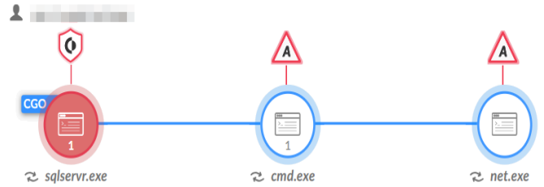

[comment]:<> (===START PAGE 1===)

{0}------------------------------------------------

[comment]:<> (===START IMAGE DETECTED===)

[comment]:<> (===START EMBEDDED IMAGE EXTRACTION===)
CGO
1
A
sqlservr.exe
cmd.exe
net.exe
[comment]:<> (===END EMBEDDED IMAGE EXTRACTION===)

[comment]:<> (===END IMAGE DETECTED===)

ALERT NAME
Uncommon user management via net.exe C:\Windows\system32\cmd.exe/c ""C:\Windows\ServiceProfiles\MSSQLSERVER\tzt.bat" "
net  user:SystemHelp B2q4xx9Bp2/add/active:"yes"/expires:"never"/passwordchg:"NO"/fullname:"Support Systems"/comment:"Built-in account for supported the computer/domain"

{1}------------------------------------------------

- http://2ndexample.com - test@something.com - test@something.com - test@something.com - test@something.com - test@something.com - test@something.com - test@something.com - test@something.com
- test@something.com - test@something.com
- test@something.com
- test@something.com - test.something.com
- test.something.com - 1.1.1.1/24
- 1.1.1.1/24
- C:\Windows\System32 - C:\Windows\System32

{2}------------------------------------------------

- http://example.something.other.com/this/file.html
- Just some text and an image link
•
•
- https://website.cdn.group-ib.com/wp-content/uploads/photo_202208-22_13-.webp

[comment]:<> (===END PAGE 1===)
